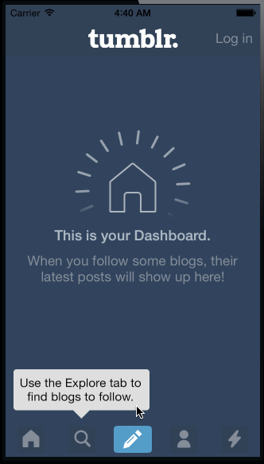

CodePath-Tumblr
===============

Custom Navigation Controller

* Completed required sections:
  * Tab bar should be implemented as a view with 5 buttons
  * Implement the 4 tabs (Home, Search, Account, and Trending) as scrollviews that contain screenshots.
  * When not on the search tab, the explore popover should appear and bounce.
  * Tapping "Log in" from the Home page should show the login form.
Compose button should show the various post buttons without animation. **Wasn't about to make the login view load from the tabbar view controller. How would that be done?**
* Time: 2.5 hrs

